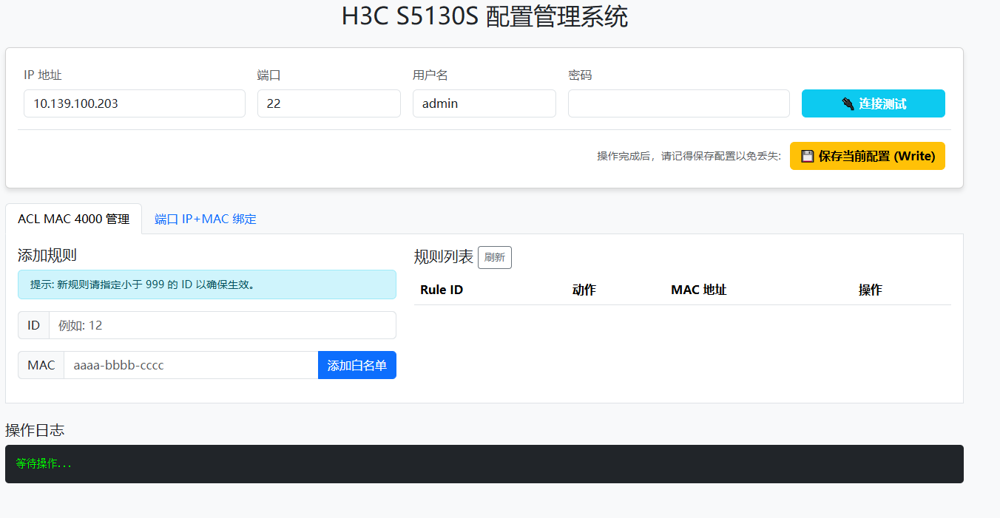

# H3C Switch Admin Tool (H3C 交换机配置助手)

基于 Python Flask + Netmiko 开发的轻量级 H3C 交换机 Web 管理工具。

## ✨ 主要功能

* **ACL MAC 4000 管理**：可视化查看、添加、删除 MAC 白名单规则。
* **端口 IP+MAC 绑定**：一键下发 `ip source binding ip-address` 绑定命令。
* **端口信息查询**：自动抓取物理端口描述 (Description) 和 Brief 信息。
* **配置备份**：一键保存当前配置 (Save)。
* **离线可用**：所有静态资源本地化，无需互联网连接。

## 🛠️ 安装依赖

```bash
pip install -r requirements.txt
```

## 🚀 启动方式
```
python run_server.py
```

访问浏览器：http://127.0.0.1:8080

## ⚠️ 注意事项

请确保运行环境能通过 SSH 连接到交换机。

## 📸 运行截图

 首页概览


 端口管理

