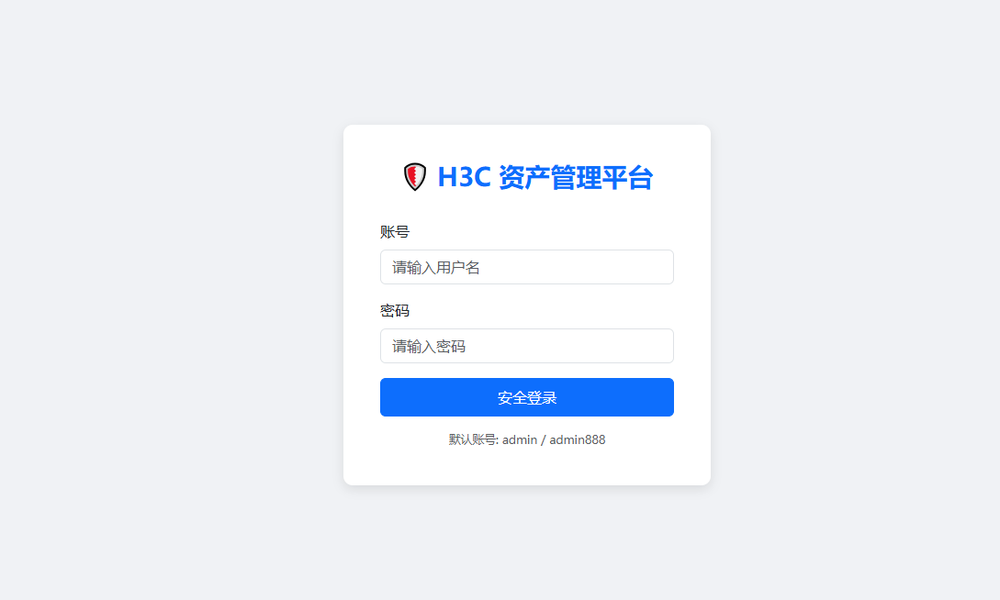
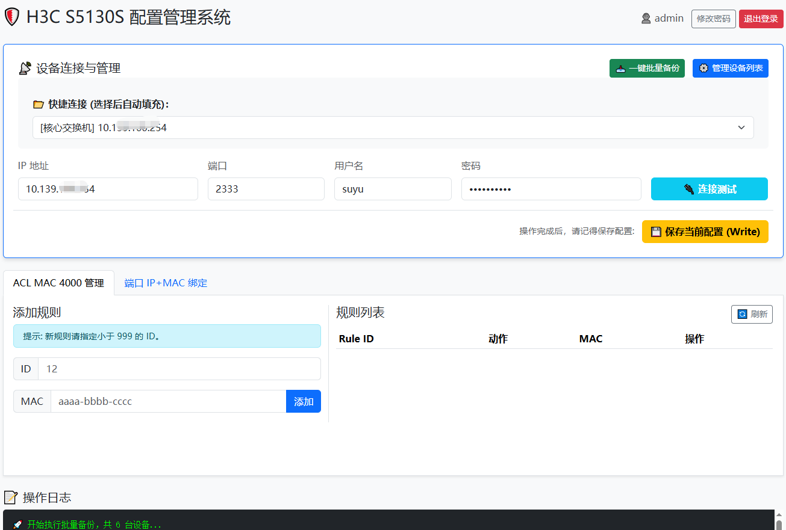
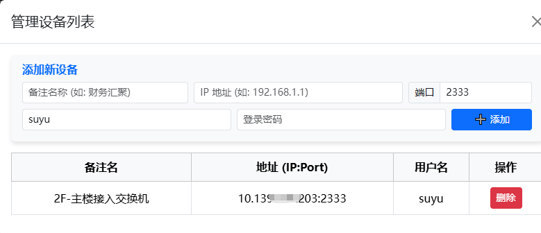
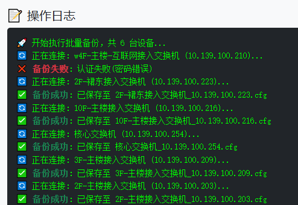
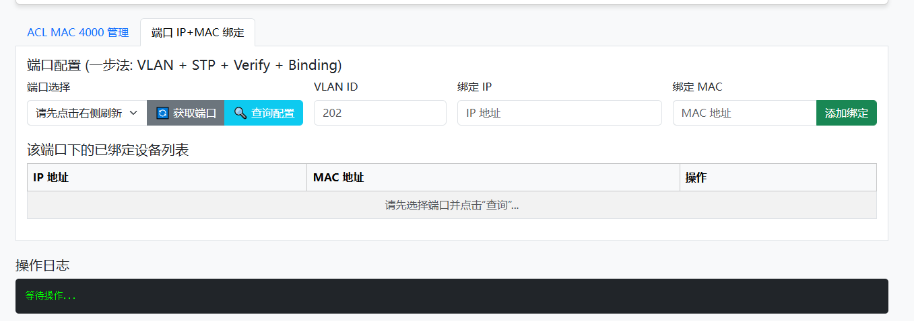
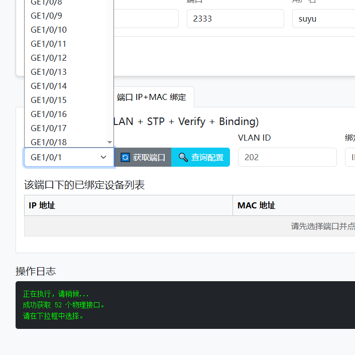
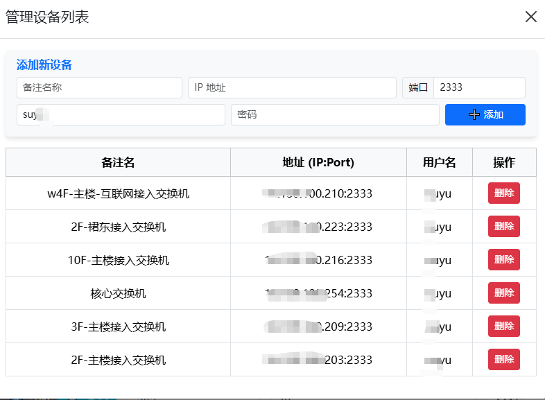
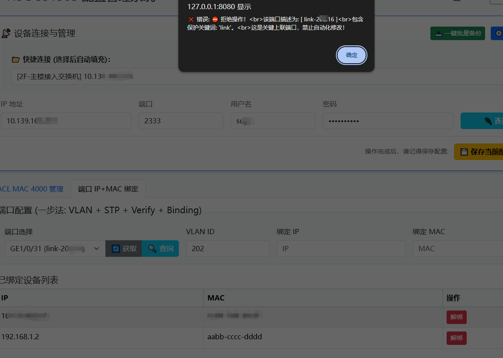

# H3C Switch Admin Tool v2.1.0


基于 Python 3.11 + Flask + Netmiko 开发的企业级 H3C 交换机 Web 运维平台。
从早期的单一脚本工具，进化为集成了 **资产管理**、**安全登录** 和 **批量自动化备份** 的综合运维系统。

**Update：v2.1.0** 

* **修复了交换机端口描述获取不到的bug**
* **添加了关键端口保护功能，避免普通用户因权限过高对核心交换机和互联口等重要端口的误操作**

## ✨ 核心功能 (Features)

### 🚀 自动化运维

* **批量配置备份 (Batch Backup)**：一键轮询数据库中所有设备，自动抓取 `display current-configuration` 并按日期归档保存。支持错误跳过与实时日志反馈。
* **ACL MAC 4000 管理**：可视化的 MAC 白名单规则(交换机上提前创建mac 4000列表)查看、添加与删除。
* **端口 IP+MAC 绑定**：自动抓取物理端口描述 (Description) 和 Brief 信息；一键下发 `ip source binding ip-address` 绑定命令 (VLAN  + Verify + Binding)。
* **配置备份**：一键保存当前配置 (Save)。
* **离线可用**：所有静态资源本地化，无需互联网连接。

### 🛡️ 资产与安全

* **资产管理 (Asset Management)**：内置 SQLite 数据库，支持 Web 端添加、删除交换机资产（支持非 22 端口）。
* **快捷连接**：下拉菜单选择设备，自动填充 IP、端口、账号密码，告别重复输入。
* **安全认证**：基于 Flask-Login 的用户登录系统，密码采用哈希加密存储。
* **操作审计**：实时显示操作日志，明确反馈成功/失败状态。
* **关键端口保护**:Smart Keyword Protection,如果描述里包含 'Uplink', 'Trunk', 'Core', 'Connect', 'To', 'hexin', 'huiju', 'link' 等关键词(不区分大小写)，系统直接拒绝操作，并弹窗警告：“这是上联端口，禁止操作！”关键词可在app.py中添加修改。

## 🛠️ 环境依赖

本项目基于 **Python 3.11** 开发，请确保你的运行环境符合要求。

```bash
pip install -r requirements.txt
```

**请确保运行环境能通过 SSH 连接到交换机。**

## 🚀 启动方式
```
python run_server.py
```

访问浏览器：http://127.0.0.1:8080

**默认账号**

- 首次启动会自动初始化数据库。
- **用户名**：`admin`
- **初始密码**：`admin888`
- 建议登录后点击右上角修改密码)

## 📂 目录结构说明

```
H3C-Switch-Admin-Tool/
├── backups/             # [自动生成] 存放批量备份的配置文件，按日期归档
├── net_assets.db        # [自动生成] SQLite 数据库，存储用户和资产信息
├── app.py               # Flask 后端核心逻辑
├── switch_driver.py     # H3C 设备交互驱动 (Netmiko 封装)
├── database.py          # 数据库操作模块 (ORM)
├── templates/           # HTML 前端页面
│   ├── index.html       # 主控制台
│   └── login.html       # 登录页面
├── static/              # 静态资源 (CSS/JS)
├── requirements.txt     # 项目依赖列表
└── README.md            # 项目说明文档
```

## ⚠️ 注意事项

- **数据安全**：`net_assets.db` 包含资产信息，请勿上传至公开仓库（`.gitignore` 已默认忽略）。
- **备份文件**：`backups/` 目录包含网络配置敏感信息，请妥善保管。
- **端口说明**：程序默认运行在 **8080** 端口，如需修改请编辑 `app.py`。

## 📜 开源协议

本项目采用 **GNU General Public License v3.0 (GPL-3.0)** 协议。

- 你可以自由地复制、分发和修改本软件。
- 如果你发布了修改后的版本，必须同样基于 GPL-3.0 协议开源。
- 本软件按“原样”提供，不提供任何形式的担保。

## 📸 运行截图

### 1. 资产管理与批量备份日志

**

**

**

**

### 2. 端口安全绑定

**
**

### 3. 设备管理列表
**

### 4. 设备端口保护
**